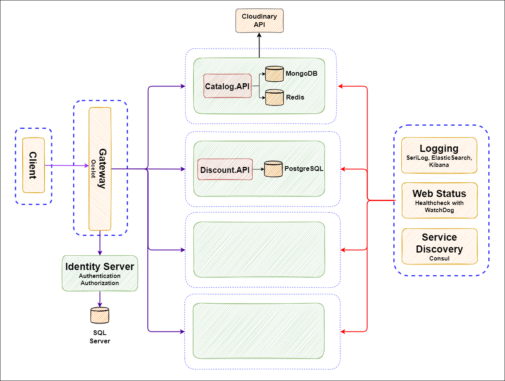

# FoodOrderingServices
APIs for Food Ordering Service

# SAD Diagram

# API Design Diagram

# General Commands
## Docker Up
`docker-compose -f docker-compose.yml -f docker-compose.override.yml up -d`

## Docker Down
`docker-compose -f docker-compose.yml -f docker-compose.override.yml down`

## Docker Build
`docker-compose -f docker-compose.yml -f docker-compose.override.yml up --build`

# Ports Usage
## Local/Docker Development
`5000/8000 - Catalog API`  
`5001/8001 - Discount API`  
`5007/8007 - Health Check`    
`5010/8010 - API Gateway`  
`5011/8011 - Identity Server`   
`5500/8500 - Consul Service Discovery`   

## Reserved Ports for Docker
`1433 - SQL Server for Identity Server`  
`5050 - PGAdmin GUI`   
`5432 - PostgreSQL for Discount`   
`5601 - Kibana GUI`  
`6779 - Redis for Catalog`  
`8081 - Mongo GUI`  
`9000 - Portainer`  
`9200 - Elasticsearch`  
`27017 - Mongo Database for Catalog`  

# Quick Links for Docker
## APIs
Catalog Service API - http://host.docker.internal:8000  
Discount Service API - http://host.docker.internal:8001  
Identity Server API/UI - http://host.docker.internal:8011  

## GUIs
Portainer - http://host.docker.internal:9000  
Mongo GUI - http://host.docker.internal:8081  
Kibana - http://host.docker.internal:5601  
Consul Service Discovery - http://host.docker.internal:8500  
PGAdmin GUI - http://host.docker.internal:5050    

## Services
Catalog API Database - http://host.docker.internal:27017  
Discount API Database - http://host.docker.internal:5432  
Catalog API Redis - http://host.docker.internal:6379  
Identity Server Database - http://host.docker.internal:1433  
Gateway - http://host.docker.internal:8010  
Elasticsearch - http://host.docker.internal:9200  

## HealthChecks
Web App - http://host.docker.internal:8007  
